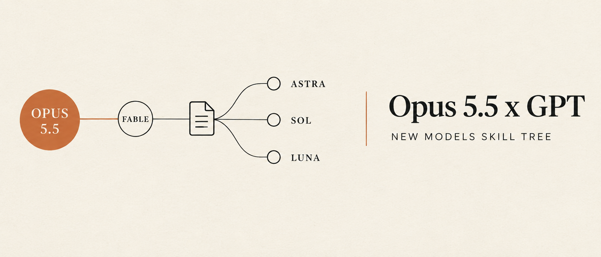

<p align="center"></p>

# Opus 5.5 x GPT New Models Skill Tree

**A multi-model routing playbook for Claude Code and OpenAI Codex.** Claude Opus 5.5 is the
flagship lead, Fable writes the markdown handoff briefs, and each build goes to the GPT-6
model that fits the job: **GPT-6 Astra**, **GPT-6 Sol** or **GPT-6 Luna**. It ships as a
skill router, a routing table, a `/codex` dispatch skill and an `AGENTS.md` template. Drop
them into `~/.claude` and `~/.codex`, and every agent session will pick the same skill and
model for the same kind of task.

Created by **[Aidan Pierce](https://github.com/AlphaSaleAidan)** · updated 2026-09-23, the day GPT-6 Sol and Luna shipped.

## The routing in one table

| Seat | Model | Does |
|---|---|---|
| Lead | **Claude Opus 5.5** | direction, taste, secrets, MCP tools, verification, the report |
| Brief writer | **Claude Fable** | the self-contained `.md` handoff each GPT job builds from |
| Hard builder | **`gpt-6-astra`** | design-heavy UI, image-to-code, new systems, money-path code review |
| Workhorse | **`gpt-6-sol`** | features, numbered fix rounds, refactors, parallel lanes (default) |
| Grinder | **`gpt-6-luna`** | lint, dependency bumps, renames, test sweeps, format conversion |
| Verifier | Claude Sonnet 5 | re-reviews, log reading, checking a lane's output |

Picking the model: payments/auth/email/DNS/deploy diffs → Astra review at high effort.
The look matters → Astra. Existing pattern or fix list → Sol. No judgment needed → Luna.
Unsure → Sol; escalate to Astra after two misses on the same symptom.

## What's inside

| File | What it is |
|---|---|
| [`SKILL-ROUTER.md`](SKILL-ROUTER.md) | Use-case → engine and use-case → skill decision tables for Claude Code and Codex agents |
| [`ROUTING.md`](ROUTING.md) | Who does what, model-pick rules, reasoning effort, the Fable → GPT → Opus handoff loop |
| [`skills/codex/SKILL.md`](skills/codex/SKILL.md) | Claude Code skill that dispatches `codex exec -m <model>` with a brief, then verifies |
| [`templates/AGENTS.md`](templates/AGENTS.md) | Standing instructions for the GPT builder (`~/.codex/AGENTS.md`) |

## Install

```bash
git clone https://github.com/AlphaSaleAidan/opus-5-5-x-gpt-skill-tree
cd opus-5-5-x-gpt-skill-tree
cp SKILL-ROUTER.md ROUTING.md ~/.claude/
mkdir -p ~/.claude/skills/codex && cp skills/codex/SKILL.md ~/.claude/skills/codex/
cp templates/AGENTS.md ~/.codex/AGENTS.md      # review before overwriting your own
npm i -g @openai/codex@latest && codex debug models   # confirm gpt-6-sol / gpt-6-luna are listed
```

Then add one line to your global `~/.claude/CLAUDE.md`:
`At the start of every task, route with ~/.claude/SKILL-ROUTER.md and ~/.claude/ROUTING.md.`

## Dispatch example

```bash
codex exec -m gpt-6-sol -c model_reasoning_effort=medium -C ./app -s workspace-write \
  -o /tmp/codex-last.md "$(cat docs/handoff/fix-checkout.md)" < /dev/null
```

`< /dev/null` is required, or `codex exec` waits on stdin.

## Why route this way

- **Cost:** sending lint and dependency bumps to Astra burns the Codex usage cap. Luna and Sol carry that volume.
- **Quality:** the builder never reviews its own work. Opus verifies, and Astra does the adversarial review on money-path diffs.
- **Consistency:** Claude and GPT read the same skill router, so the same task always gets the same skill.

## License

MIT © 2026 Aidan Pierce
